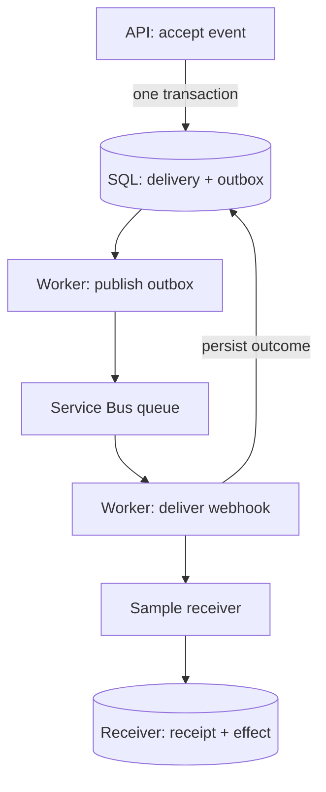

# Architecture

Status: selected starting design. Codex may resolve implementation details within these contracts and document meaningful choices in docs/DECISIONS.md. A change to the public guarantee, platform or milestone scope needs owner direction; ordinary fixes do not.

## Components

| Path to create in M1 | Responsibility |
| --- | --- |
| src/RelayLab.Api | Validate/accept events, expose status and health |
| src/RelayLab.Worker | Publish the outbox and consume delivery messages |
| src/RelayLab.Core | Shared application and persistence code where needed |
| samples/RelayLab.Receiver | Controlled external-recipient stand-in |
| tests/RelayLab.Tests | Unit, SQL integration and broker-backed acceptance |
| eng/ | Actual verification and demo entry points |

Use one application database shared by API/Worker. The receiver has a separate database, which can share the local SQL Server instance. The service never queries recipient internals; acceptance tests may use them as an oracle. The emulator's own backing database is infrastructure, not the application's database.

Publisher and Consumer are responsibilities of one Worker executable, not extra microservices.

## Stack

C#/ASP.NET Core on supported .NET 10; EF Core SQL Server provider; Azure.Messaging.ServiceBus; Docker Compose; xUnit and Testcontainers. M2 adds OpenTelemetry with an existing local viewer. M3 uses Terraform and Azure Container Apps, Azure SQL and Service Bus.

Select released compatible SDK/package/image versions after inspecting the host. Verify an actual container send/receive and SQL connection early, before implementing substantial product logic. Record versions and compatibility results; generate lock files. Use a single test runner supported by the chosen packages. The host's installed supported .NET 10 SDK is preferred over a new feature-band requirement.

The direct SDK plus a small application-specific outbox keeps the transaction behavior visible. Do not build a general framework around it. Existing messaging frameworks are a production alternative; record why their extra abstraction is unnecessary for this one-queue sample. A future framework switch is a material decision, not a recovery workaround hidden in a test fix.

## Persistence and boundaries

Start with logical Delivery, OutboxMessage and DeliveryAttempt records. Exact tables and indexes are implementation choices. Store validated request fields needed to compare repeated idempotency keys; use SQL uniqueness with the same case-sensitive semantics as the API. A check-then-insert query alone is insufficient.

Accept Delivery and OutboxMessage in one SQL transaction. Return acceptance only after commit. A failed response after a committed transaction is resolved by retrying the same idempotency key.

The dispatcher claims pending outbox work, publishes outside the transaction and marks publication durably. A send that succeeded before its acknowledgement or before the SQL update can be repeated. Its message identity must remain stable for that outbox item. Do not claim atomicity across SQL and Service Bus.

The consumer validates the envelope, checks current SQL state and claims eligible delivery work using a conditional update/expiring lease. HTTP occurs outside SQL transactions. Only the current lease owner may commit its result. Leases must expire and be recoverable after a crashed process; use consistent time semantics. A row version/lease protects local state, not an external HTTP effect.

Receive in PeekLock mode with explicit settlement. A previously Delivered item is completed without another necessary HTTP call. Persist a normal delivery outcome before completion. If the broker acknowledgement fails after persistence, later receipt observes durable state.

The receiver commits a unique receipt for DeliveryId and its example effect in one transaction. Returning success follows that commit. It must recognize duplicate DeliveryId even after its own restart. The same ID with conflicting content is a protocol conflict, not a new effect.

## M1 failure policy

M1 demonstrates the happy path, acceptance idempotency and durable backlog during publisher unavailability. A definitive non-2xx HTTP response or timeout is recorded as Failed after the single M1 HTTP attempt; a timeout's recipient outcome is marked unknown. There is no full HTTP retry schedule/replay feature until M2.

Outbox transport failures retain work for a bounded-interval publishing retry. Broker redelivery after worker/settlement failure remains possible even in M1; the stable DeliveryId and receiver ledger are required from the start. Configure bounded processing and broker delivery limits, preserve dead-lettered messages and document their inspection. A broker transport exhaustion is not evidence that the remote recipient had no effect. Surface stale/incomplete state honestly rather than calling it Delivered.

## M2 recovery extension

The application database owns retry eligibility, attempt history and terminal outcomes. New retry/replay work is persisted with an outbox entry in the same transaction before completing the old message. Define stable logical DeliveryId separately from unique work/attempt or replay-generation IDs. Reject stale work against current state. Broker deduplication must not swallow intentional new work.

Choose the smallest durable scheduling mechanism and document the crash windows before implementing it. Bound attempts, timeout, delay/backoff and concurrency. Distinguish HTTP retries, SDK transport retries and broker redeliveries so they do not multiply unnoticed. Terminal application failure and broker dead-letter state are related but not interchangeable. Make replay of an exhausted delivery idempotent and preserve the stable recipient identity and prior history.

Test competing worker instances in M2. Persistent claims and retry eligibility must recover after process termination. Bounded recovery assumes durable dependencies retain state and become available within the relevant retention limits; it does not guarantee success against a permanently failing recipient.

## Local versus cloud

Docker Compose serves the demo. Testcontainers owns test dependencies and reuses the selected images and queue configuration. Shared-emulator test cases execute sequentially. The Service Bus emulator loses data on restart; interrupt connectivity without deleting state when demonstrating a temporary broker outage.

Local endpoints bind to loopback/publish host ports to loopback; internal container addresses can remain service names. Local unauthenticated behavior must not silently survive a cloud deployment. M3 adds authenticated ingress, managed identity, controlled receiver access and reviewed secret handling. Details are in docs/OPERATIONS.md.

Telemetry is diagnostic evidence, not the durable source of truth. Payloads/secrets stay out of logs. The lifecycle remains inspectable when the telemetry viewer is down.
